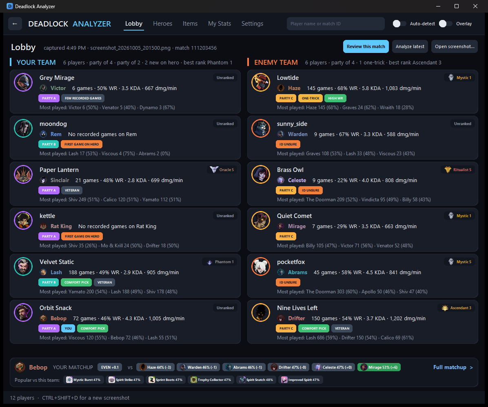

# Deadlock Analyzer

### [⬇ Download for Windows](https://github.com/mjaylove22/deadlock-analyzer/releases/latest/download/DeadlockAnalyzer-Setup.exe)

Free · Windows 10 and 11 · 28 MB · [what's new](https://github.com/mjaylove22/deadlock-analyzer/releases/latest)

See who's in your Deadlock match. Open the scoreboard in game and, a few seconds later, the app shows every
player's rank, their record on the hero they're playing, their favourite heroes, who's queued together, and
whether you've played with or against them before. When the match ends, it shows how everyone played compared
with other players on the same hero.



<sub>Player names in this picture are made up.</sub>

## Install

1. **Click [Download for Windows](https://github.com/mjaylove22/deadlock-analyzer/releases/latest/download/DeadlockAnalyzer-Setup.exe).**
   If your browser says the file *isn't commonly downloaded*, choose **Keep** (in Edge: **...** then **Keep**,
   then **Show more**, then **Keep anyway**).
2. **Open the downloaded file.** Windows will probably say **"Windows protected your PC"**. Click
   **More info**, then **Run anyway**.
3. Click **Install**. It doesn't ask for an administrator password, and it adds the app to the Start menu
   and your desktop.

**Why Windows warns you:** Windows warns about any program it hasn't seen many people run, unless the
developer has bought a code-signing certificate. This is a free hobby project without one. Everything in
the installer is built from the code on this page, which anyone can read.

**"Smart App Control blocked an app"** (some Windows 11 PCs, with no Run anyway button): Smart App Control
only runs code-signed programs it doesn't already know, and this free hobby app isn't signed, so it can't be
installed while Smart App Control is on. Whether to turn it off is your choice: on some Windows 11 versions it
can't be turned back on without resetting Windows.

## First steps

1. **Find your account.** On the app's Home page, type your Steam name and click **Find me**. Open the
   account that's yours (check the picture and the number of games), then click **Set as my account**.
   The app then recognises you in every lobby and shows your matchup.
2. **Play.** Leave the app open (a second monitor is ideal). During a match, press **Esc** and open the
   **PLAYERS** tab. The app notices, reads the scoreboard and shows the lobby a few seconds later, with a sound.
   You can close the menu straight away.
3. **After the match**, the end-of-match scoreboard opens a review of how everyone played.

Good to know:
- **Deadlock must be set to English.** The app reads the words on the screen.
- It works in **fullscreen** and in windowed modes. The **Overlay** switch (the app floating over the
  game) only works in **borderless windowed** mode.
- **Ctrl+Shift+D** captures the scoreboard by hand, if it's ever missed.
- **Something went wrong?** Settings, **Open log folder**, and send `app.log` with a note of what happened.

**Updating:** when there's a new version, the app's Home page says so. Click **Update now**: the app downloads
the installer, checks it's the exact file published on GitHub (its SHA-256), installs it and opens again a few
seconds later, with your settings and notes kept. It won't update while Deadlock is running, and never on its own.
(**Download update** still works too: run the file it downloads.) **Uninstalling:** Windows Settings, **Apps**, **Installed apps**,
Deadlock Analyzer. That also removes its settings, notes and screenshots.

## Is it safe to use with the game?

The app only **looks at your screen**, the way Discord or OBS screen sharing does, and reads the text in
those screenshots. It never reads or changes the game's memory, never injects anything into the game, never
edits game files and never presses keys or moves the mouse for you. Those are the things cheats do and
anti-cheat looks for. The one keyboard shortcut it listens for (Ctrl+Shift+D) works like Discord's
push-to-talk key.

Valve doesn't approve or certify third-party tools, so nobody can promise you anything on Valve's behalf.
But nothing this app does touches the game itself.

**Your data:** the app has no account system and collects nothing about you. It connects to:
- the public [Deadlock API](https://deadlock-api.com) (`api.deadlock-api.com`), asking about the Steam names
  it reads in a lobby, the players and matches you open, and your own match history (for "met before");
  hero and rank pictures come from
  `assets-bucket.deadlock-api.com`, profile pictures from Steam (`avatars.steamstatic.com`);
- Steam's public news for Deadlock (`api.steampowered.com`), at most once an hour, for the Patches page;
- GitHub (`api.github.com`), at most every 6 hours, to see whether there's a new version, and, only when you
  click **Update now**, GitHub's file servers (`github.com`, `*.githubusercontent.com`) for the installer.
  Nothing about you is sent.

Screenshots are never uploaded. Your settings, your notes on players and the screenshots stay on your PC,
and screenshots are deleted after 3 days.

## What it shows

For every player in the lobby:

- **Stats on the hero they're playing right now:** games, win rate, KDA, damage per minute
- **Badges:** ONE-TRICK, ON MAIN, COMFORT PICK, NEW ON HERO, FIRST GAME ON HERO, HIGH WR / LOW WR, VETERAN
- **Rank**, in the game's rank colours
- **Parties:** friends queued together on the same team share a colour, and the team line says how many games
  they've played together
- **WATCH** on up to 3 enemies with two or more reasons to watch them (main hero, high win rate on it, 100+ games
  on it, the lobby's top rank, a party); hover it for the reasons
- **Their Steam avatar** and a click-through to their page (all their heroes, matches and your notes)
- **ID UNSURE** when the account match is a close call, so you know when not to trust it
- **NO RECENT DATA** when the public API hasn't recorded any of their games for days, so the card may be out of date
- **NAME FIXED** when the app misread one character of a name and found the real Steam name
- **Your history with them**: `FACED 3× · 2-1` (matches against them, your wins-losses) or `ALLY 4× · 1-3`
  (with them), and **your own note** on them

**Your matchup** (once you've set your account) appears at the bottom: your hero's win rate against each
enemy hero compared with its usual (red = harder, green = easier), and the items that help against this team.
30 seconds after a lobby captured in game appears, the window switches to the **full matchup**, which also shows
each enemy's rank, badges and WATCH pill (not for a screenshot you open yourself). Click anything before then and it stays where you are; **Back** returns to the lobby.

The app has pages, with a **Back** button (or Alt+Left) and the title as a link to **Home**:

| Page | What it shows |
|---|---|
| **Home** | Your account, the last lobby, the strongest heroes right now, and your recent matches with a summary of your last session (record, K/D/A, souls per minute, rank change in ranked). Matches appear as soon as their end screen is read |
| **Lobby** | Each team as a row of player tiles, with your matchup at the bottom. Hover a pill for what it means; click a player to open their page. **Review this match** opens the match once it's over |
| **Matchup** | Your hero against this team: with each teammate's hero, and a card per enemy (toughest first) with the player's record on their hero, your win rate against that hero, your K/D/A against them and the items that help most |
| **Settings** | What happens when the scoreboard opens in game (bring the app to the front without taking focus from the game, a sound, open the review when a match ends) and what the lobby cards show (Simple or Full, or switch each part), and a dark or light theme |
| **Heroes** | Every hero's win rate, pick rate, ban share, games and KDA, by mode and rank, with a 12-week trend line per hero |
| **Items** | Every shop item: how often it's bought, win rate, tier, cost and typical purchase time, with a 14-day trend |
| **Patches** | Deadlock's update notes and announcements in full, newest first, from Steam. Pick a hero to see only the updates that changed them, and only those lines |
| **Hero** | **Stats**: win rate over 12 weeks, best and toughest matchups, most-bought items and win rate at every rank. **Guide**: what kind of hero it is, what its abilities do and what players build |
| **My Stats** | Your own player page, with **your form**: your last 20 matches against the 20 before (souls per minute, KDA, win rate), overall and per hero, calling out only changes bigger than luck; and your **rank progress** since placement (hover it for every rank change) |
| **Coach** | Patterns in your last 30 normal matches (or only those on one hero). **Summary**: your biggest weakness and biggest improvement, what else stands out, your stats on your hero against players at your rank, and your laning and where your souls come from against your lobbies. **Deaths**: a map of where you die (red: no teammate near), how you die against the other players in your lobbies, and the patterns in it (when, alone or not, a hero that kills you more than chance would). Every finding says how sure it is: *early sign*, *likely* or *consistent*, from how many matches it rests on and how big the gap is, so a 3-game streak never reads as a habit. Matches count once the stats site has stored them, usually a few hours after the game |
| **Player** | Rank, games and win rate for ranked, unranked and Street Brawl, your record with them, a note box (kept only on your PC), who they play with most, per-hero stats and every recorded match. Filter the matches by type (the same switch as the hero stats), by hero (click one in the hero table) and by wins or losses |
| **Match review** | **Overview**: victory or defeat, your K/D/A, net worth, damage, healing and last hits against your usual on that hero, your build, the net-worth lead over time and both scoreboards, with a few lines on how the match went (when the lead changed hands for good, the biggest swing). **Performance**: every stat against other players on the same hero, at the same rank, in matches of a similar length ("better than 82% of Kelvin players"), and a score for every player |
| **Search** | Type any Steam name in the top bar to see every account with that name, or a **match ID** to open its review |

**Overlay** keeps the window semi-transparent and on top of the game (borderless windowed only). While it's on,
the window is hidden from screen capture so it never covers the scoreboard in its own screenshots; that also
hides it from Discord/OBS streams. With overlay off, it shows up in screen sharing normally.

## Limitations

- **Screen sizes:** built and checked on real 1920x1080 screenshots. Other sizes (1440p, 4K, ultrawide, 16:10)
  are found automatically and tested with simulated screenshots; real ones are still needed to confirm them.
- Some players can't be found: Steam names aren't unique, the screen text is occasionally misread, and some
  accounts aren't in the public API. Unsure matches are marked rather than guessed.
- The full match review (build, net-worth chart) appears once the match reaches the public API, which can take
  a while; bot matches never do. The end-of-match screen is read straight away in the meantime.
- **Ban share** is each hero's part of all recorded bans, not a ban rate (the API doesn't say how many matches
  the bans came from). The ranking is the same either way.
- Hero stats and badges count normal matches; Street Brawl and bot matches aren't included.

---

## For developers

### How it works

```
screenshot ──► OCR (Tesseract) ──► player / hero / team ──► public Deadlock API ──► favourite heroes, win rates
```

1. **Capture**: the app (`app.py`) runs in the background and takes a screenshot when the scoreboard opens
   (auto-detect) or when you press `Ctrl+Shift+D`.
2. **OCR**: `scoreboard_ocr.py` crops the scoreboard's player list and runs Tesseract once.
   Every scoreboard row is two lines, a Steam name and then `<Hero> Level N`, so each line containing
   a hero name and "Level" is paired with the line above it. Each line's vertical position decides the team.
3. **Lookup**: `player_lookup.py` searches the [Deadlock API](https://api.deadlock-api.com) for each Steam name
   and fetches per-hero stats.
   - Steam names aren't unique, so `identity.py` resolves the whole lobby together: unique names first,
     then candidates who are Steam friends with already-identified players, then hero history.
   - Friends on the same team are reported as a party.
   - Players whose name equals their hero (bots in bot lobbies) are skipped.

**Ground rules:** screenshots and public web data only. No game memory reading, code injection, game-file
edits (including Valve's game-state-integration config), input automation or anti-cheat interaction.

For the reasoning behind every design decision, see [docs/DESIGN.md](docs/DESIGN.md).

### Running from source

1. Get the code (a git clone, or **Code → Download ZIP** on GitHub, unzipped).
2. Double-click **`setup.bat`**. It installs whatever is missing with winget (built into Windows 10/11):
   Python 3.13 and the [Tesseract OCR](https://github.com/UB-Mannheim/tesseract/wiki) engine (Windows asks
   for permission once), then the Python packages, and puts a **Deadlock Analyzer (source)** icon on your
   desktop. If it had to install Python, it asks you to run it once more.
3. Start the app from that icon. If Tesseract is ever missing, the Home page offers to install it.
4. **To update:** `git pull` in the folder (or download the ZIP again), then run `setup.bat` again.

By hand instead: Python 3.13+, Tesseract (to `C:\Program Files\Tesseract-OCR`),
`pip install -r requirements.txt`, and optionally `python make_shortcut.py`.

```bash
python "Deadlock Analyzer.pyw"      # the app
python player_lookup.py             # report for the latest screenshot (or pass a path)
python scoreboard_ocr.py            # debug view: raw OCR lines and parsed rows
python -m unittest discover -s tests -v
```

### Building the installer

`pip install -r requirements-dev.txt`, `winget install JRSoftware.InnoSetup`, then `python installer/build.py`.
`dist/` then holds `DeadlockAnalyzer-Setup-<version>.exe` (PyInstaller one-folder app with a trimmed
Tesseract, wrapped by Inno Setup). Each GitHub release carries it under that name and as
`DeadlockAnalyzer-Setup.exe`, which is what the download link above points to.

**Releases are built by GitHub Actions** ([build.yml](.github/workflows/build.yml), about 2 minutes): bump
`version.py`, commit, then `git tag v<version>` and `git push origin v<version>`. The workflow runs the tests,
builds both installer files and makes a draft release to write notes for and publish. If the tag push
doesn't start a run, `gh workflow run build.yml --ref v<version>` does the same. Pushing workflow changes
needs a token with the `workflow` scope (`gh auth refresh -s workflow`).

**Light:** about 80 MB of memory, the window opens in about a second, and the local cache stays around 2 MB.
API answers are reused for a few minutes, so going Back or revisiting a page is instant.

### Project layout

```
app.py               desktop app: window, navigation, background tasks, capture and auto-detect
layout.py            finds the scoreboard at any screen size (checked by the PLAYERS-tab detector)
game_window.py       finds the Deadlock window (any monitor, windowed or not)
ui/                  theme, images, reusable widgets (cards, sortable tables) and the pages
assets.py            hero portraits and rank emblems, cached on disk
scoreboard_detector.py  spots the open scoreboard from a tiny screen grab
Deadlock Analyzer.pyw  double-click launcher (no console window)
screenshot_manager.py
scoreboard_ocr.py    screenshot -> [{"player", "hero", "team"}]
deadlock_api.py      thin client for the public Deadlock API
identity.py          which same-named account is which; party detection
player_lookup.py     whole-lobby lookup and command-line report
matchups.py          your hero vs the enemy heroes, and popular items against them
profiles.py          player pages (per-hero stats, recent matches, modes) and the hero tier list
match_review.py      post-game review: condenses a match's data, saved on disk
updater.py           one-click updates: download, check the SHA-256, run the installer
patches.py           the Patches page: Deadlock's update notes from Steam, as text
coach.py             the Coach tab: patterns across your recent matches, and tips
end_screen.py        spots the end-of-match screen and reads its scoreboard and match ID
postgame.py          waits for a finished match's data without wasting Steam fetches
settings.py          settings.json: window layout and which account is you (stays on your PC)
paths.py             where shipped files and the app's own files live, from source or installed
version.py           the version number and release links (shown on Home, used by the installer)
installer/           build.py (Tesseract trim + PyInstaller + Inno Setup), setup.iss, licence notices
make_shortcut.py     creates the from-source desktop shortcut
performance.py       how well someone played their hero: stats as percentiles among players on that hero
insights.py          stats on the current hero and badge rules
history.py           your history with other players: matches with/against them, and your notes (notes.json)
report.py            wording shared by the terminal and the app
tests/               unit tests (API calls are mocked)
tools/privacy_scan.py  pre-commit hook: blocks commits containing real player names or IDs (--install)
docs/DESIGN.md       design decisions and technology choices
utils/logger.py      logging to logs/app.log and the console
```

## License

[MIT](LICENSE). Not affiliated with or endorsed by Valve.
